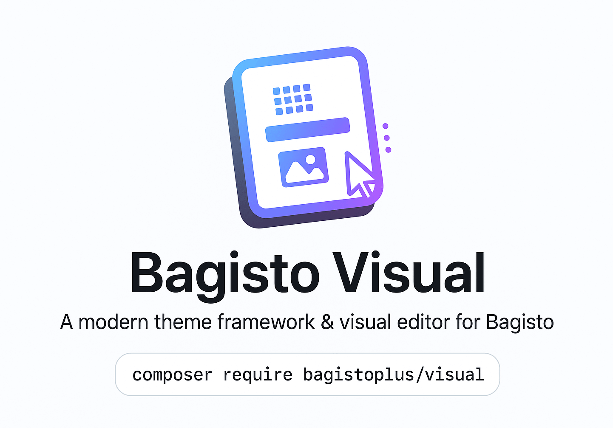

# A modern theme framework and visual editor for Bagisto

[](https://packagist.org/packages/bagistoplus/visual)
[](https://github.com/bagistoplus/visual/actions?query=workflow%3Arun-tests+branch%3Amain)
[](https://github.com/bagistoplus/visual/actions?query=workflow%3A"Fix+PHP+code+style+issues"+branch%3Amain)
[](https://packagist.org/packages/bagistoplus/visual)

## Features

Bagisto Visual provides everything you need to build powerful, customizable themes for the Bagisto e-commerce platform.

- Modular theme framework with a clean, organized structure
- JSON-based templates for layout flexibility and reusability
- Visual drag-and-drop theme editor for merchants and developers
- Prebuilt and customizable sections using Blade or Livewire

## Installation

You can install the package via composer:

```bash
composer require bagistoplus/visual
```

> **ℹ️ Note:** Make sure your `composer.json` includes:
>
> ```json
> "minimum-stability": "dev",
> "prefer-stable": true
> ```
>
> This ensures the alpha version of Bagito Visual can be installed properly.

You can publish the config file with:

```bash
php artisan vendor:publish --tag="visual"
```

## Documentation

Visit the official documentation for full guides at: [https://visual.bagistoplus.com](https://visual.bagistoplus.com)

## Requirements

- Bagisto version: ^2.2
- PHP version: ^8.1

## Changelog

Please see [CHANGELOG](CHANGELOG.md) for more information on what has changed recently.

## Contributing

We welcome issues, ideas, and pull requests.

Please see [CONTRIBUTING](CONTRIBUTING.md) to get started.

## Credits

- [Eldo Magan](https://github.com/eldomagan)
- [All Contributors](../../contributors)

## License

The MIT License (MIT). Please see [License File](LICENSE.md) for more information.
